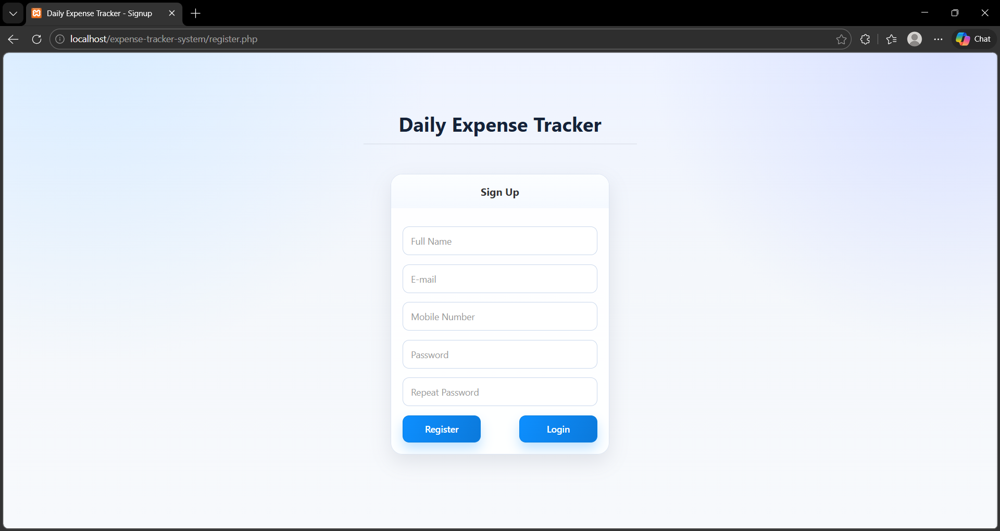
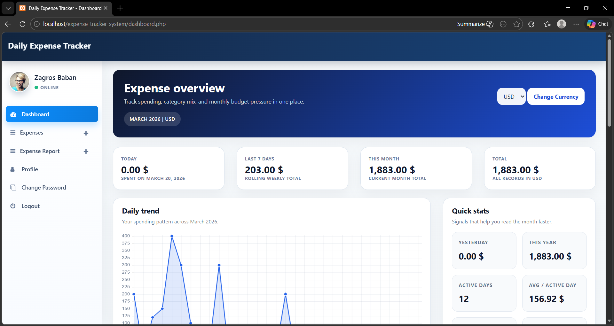
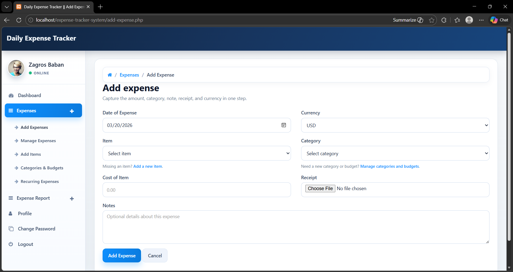
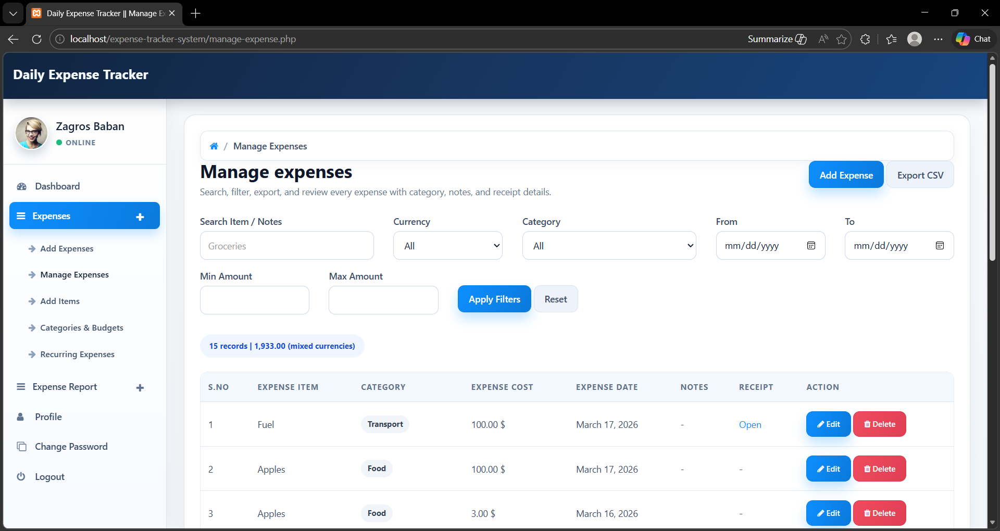
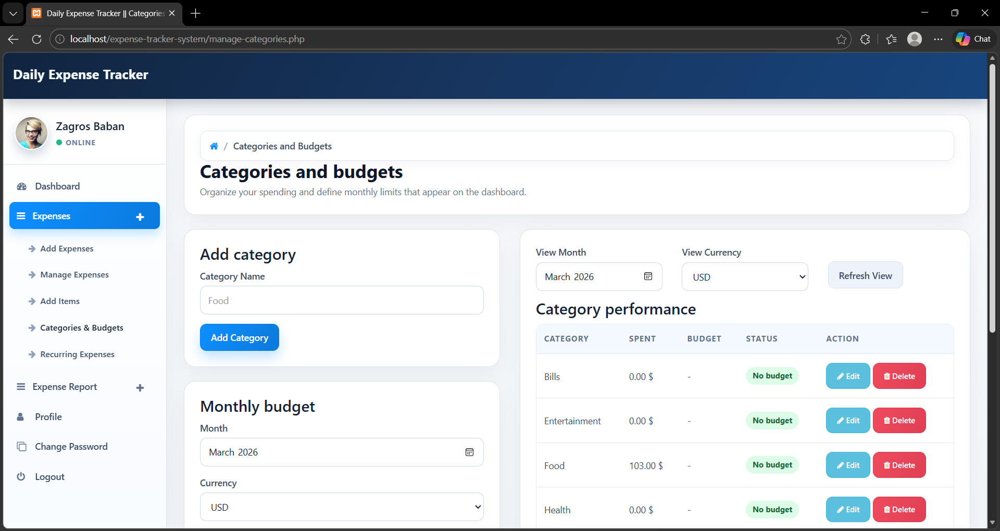
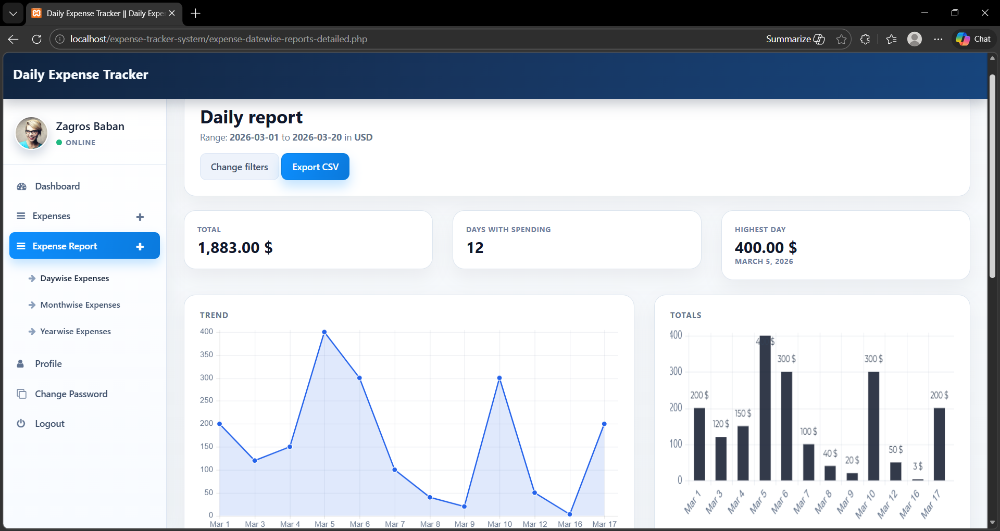
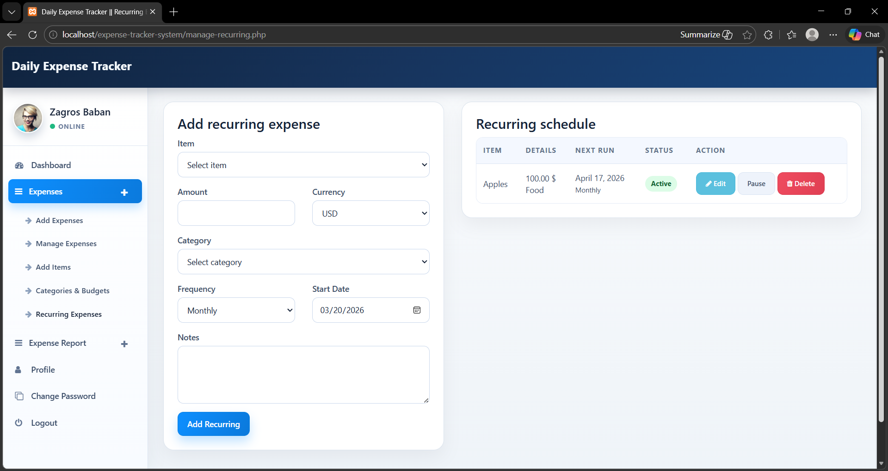
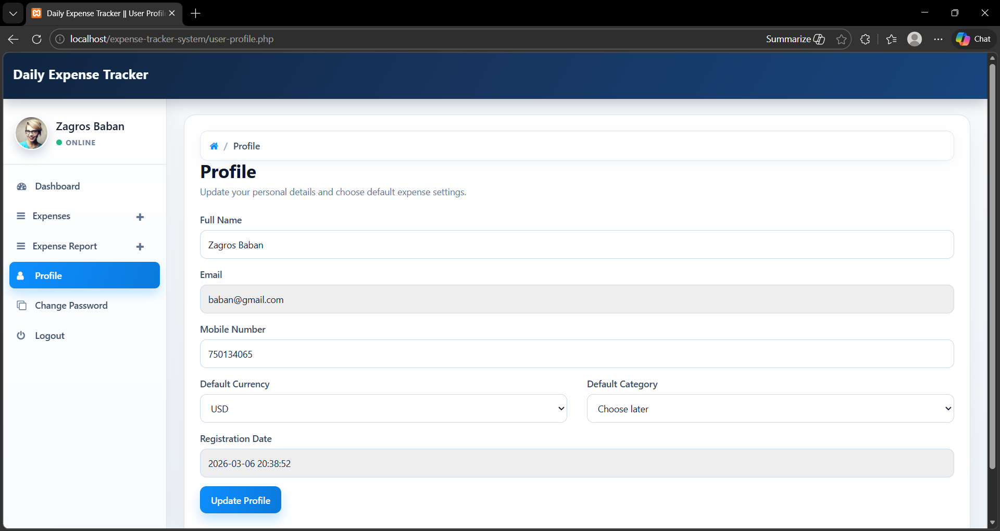

# System Screenshots

## Figure 1. User Registration Page

This screen allows a new user to create an account by entering full name, email address, mobile number, password, and repeated password. It is the entry point for new users who want to access the expense tracking features of the system.

## Figure 2. Dashboard Page

The dashboard gives a summarized overview of user spending. It presents key metrics such as today's expenses, last 7 days, current month, and total expense. It also includes charts and quick statistics to help the user understand spending behavior visually.

## Figure 3. Add Expense Page

This page is used to record a new expense. The user can select the date, currency, item, category, cost, notes, and upload a receipt file. It is one of the core input pages of the application.

## Figure 4. Manage Expenses Page

This screen displays stored expense records in tabular form. It supports searching, filtering, exporting to CSV, editing, and deleting expense entries. This page is important for reviewing and controlling previously entered data.

## Figure 5. Categories and Budgets Page

This page allows the user to create categories and assign monthly budgets. It also displays category performance by comparing spent amounts against budgeted amounts. This supports financial planning and budget control.

## Figure 6. Daily Report Page

This page presents analytical output for a selected date range. It includes total expense, number of active spending days, highest spending day, and graphical charts. It helps the user analyze short-term spending trends.

## Figure 7. Recurring Expenses Page

This page is used to define repeated expenses such as subscriptions or monthly bills. The user can choose item, amount, category, frequency, and start date. The system then automatically adds expenses when the due date arrives.

## Figure 8. User Profile Page

This page stores and updates user information such as name, email, mobile number, default currency, and default category. It also provides a way to personalize system behavior according to user preferences.

