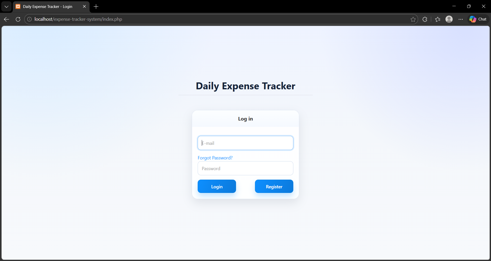
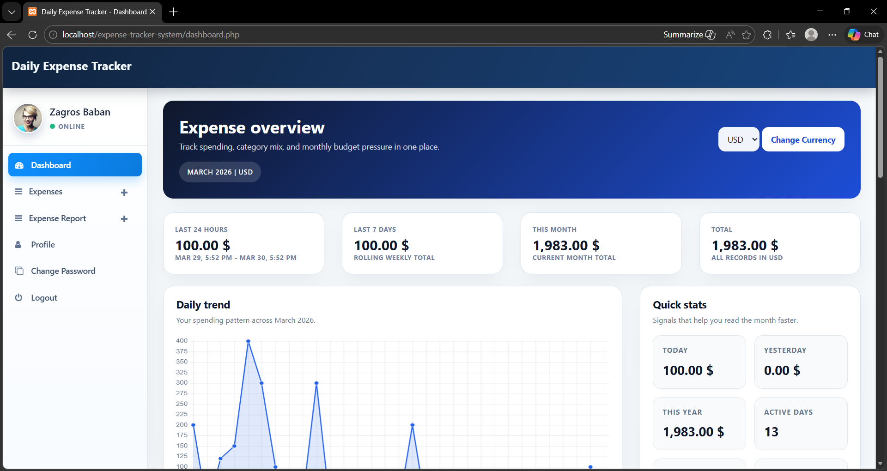
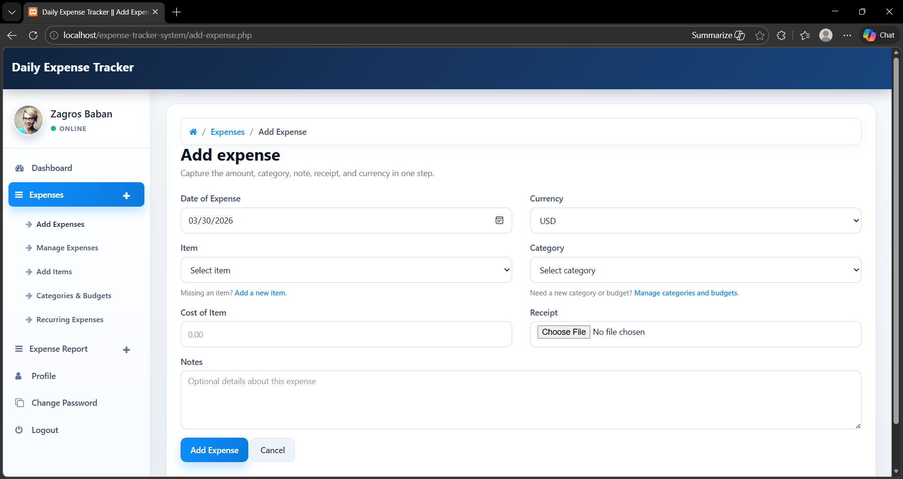
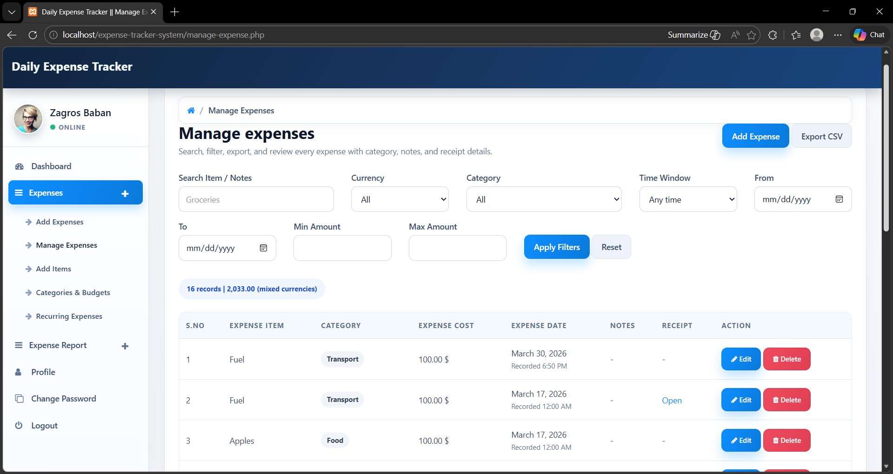
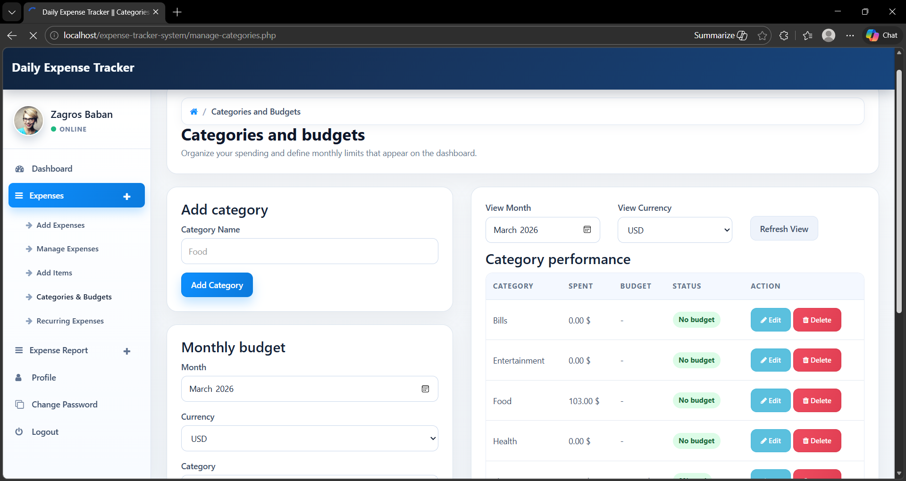
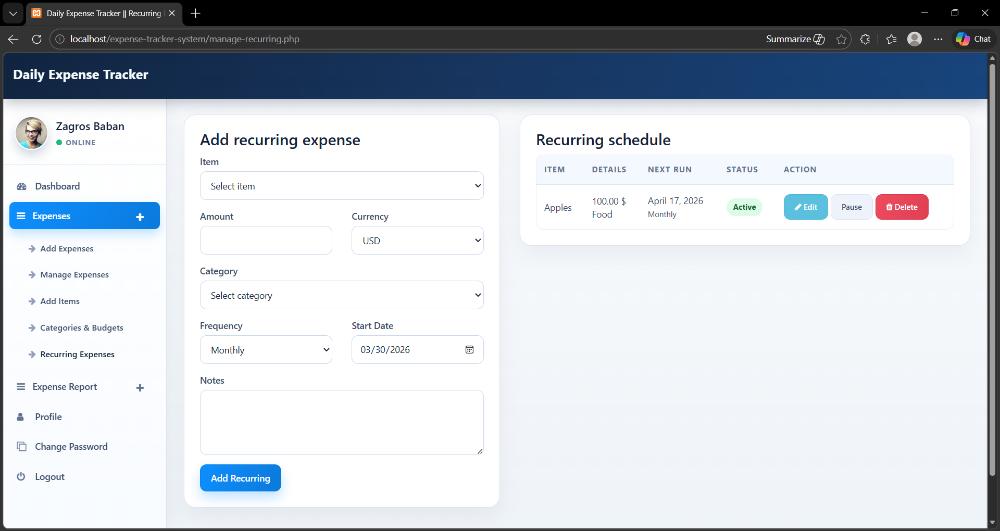
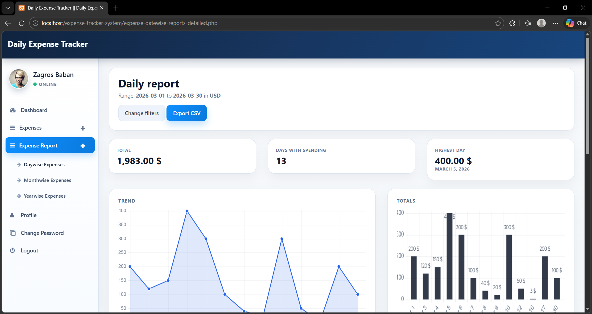
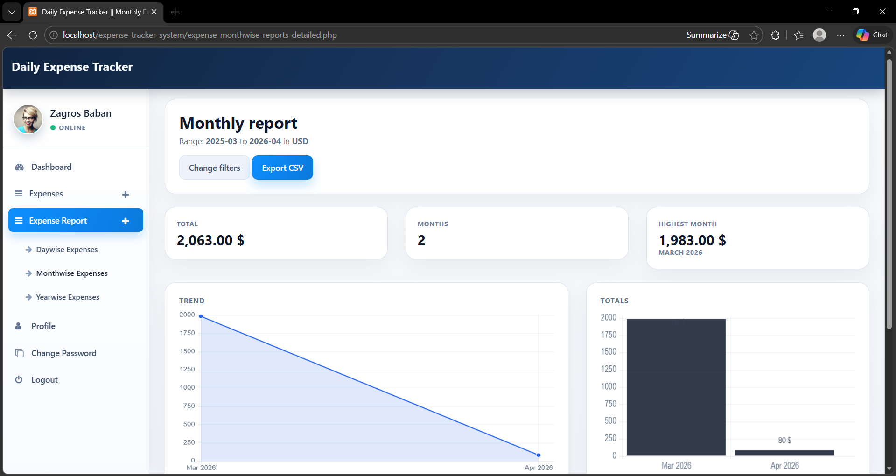
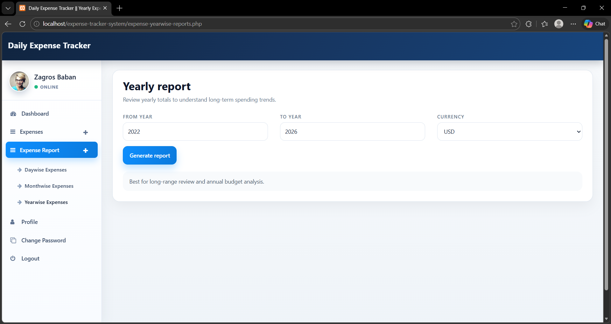
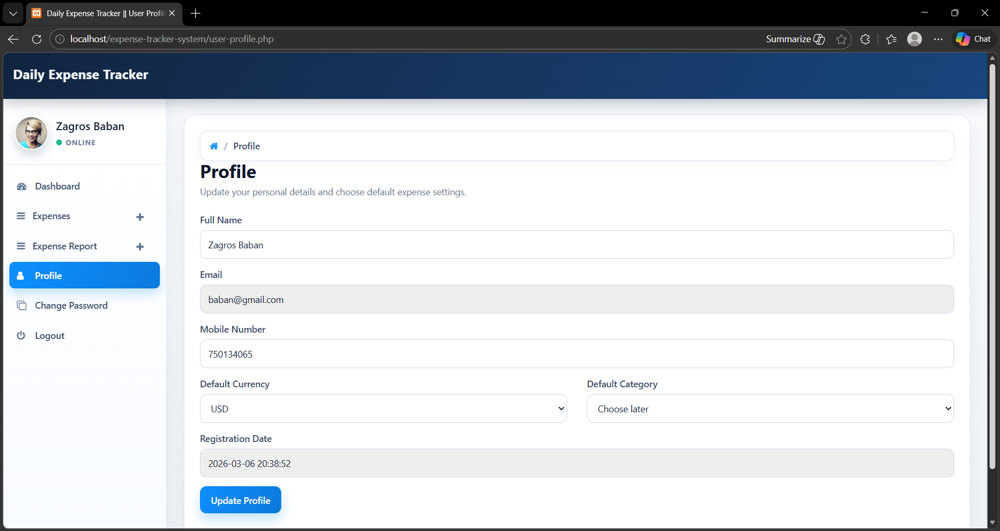

---
title: User Guide
nav_order: 10
---

# User Guide

## How to Use the System

1. Open the application in a browser.
2. Register a new account or log in with an existing account.
3. Add expense items if the list is empty.
4. Create categories and define monthly budgets if desired.
5. Add expenses by entering date, item, amount, category, currency, notes, and optional receipt.
6. Open the dashboard to review spending summaries and charts.
7. Use the Manage Expenses page to search, filter, edit, delete, or export data.
8. Use the Recurring Expenses page to automate repeated payments.
9. Use the report pages to analyze spending by date, month, or year.
10. Update the profile page to choose a default currency and category.

## Main User Benefits

- Simple daily expense recording
- Better budget control
- Clear visibility into spending habits
- Historical analysis through reports
- Exportable records for further processing

## Screenshots

The following screenshots show the main pages of the system used in this project:

### Login Page

### Registration Page

### Dashboard Page

### Add Expense Page

### Manage Expenses Page

### Categories and Budgets Page

### Recurring Expenses Page

### Date-wise Report Page

### Month-wise Report Page

### Year-wise Report Page

### Profile Page

